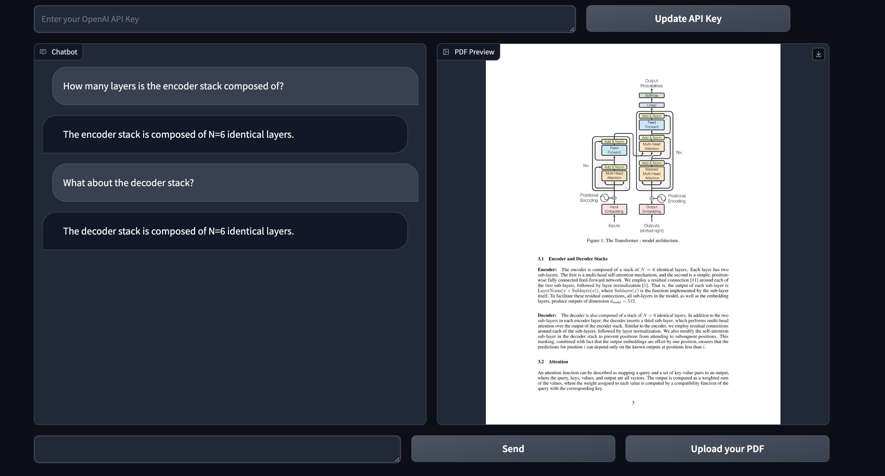

# ChatPDF-QA

## Overview

PDF-QA is a local app through which you can interact with a PDF document using a chatbot-style interface. It uses Langchain, Gradio and OpenAI's GPT models to allow the user to ask questions related to the document's content and receive informative responses. 

## Prerequisites

Before running the application, ensure you have the following prerequisites installed:

- Python 3.x
- Required packages listed in `requirements.txt`:
`pip install -r requirements.txt`
- OpenAI API key: Obtain your API key from [OpenAI](https://platform.openai.com/docs/overview). For further instructions, refer [here](https://platform.openai.com/docs/quickstart?context=python) 

Note: Keep your OpenAI API key safe and save it locally


## Demo Screenshot


## Instructions

1. After cloning the repository, on a terminal, run the following command:
`python main.py`
2. You should see something like this on your terminal:
```
Running on local URL:  http://127.0.0.1:7860

To create a public link, set `share=True` in `launch()`. 
```

Click on the local URL to use the interface locally

3. Copy your OpenAI API key in text box that says "_Enter your OpenAI API Key_".
4. Upload a local PDF and ask any questions about using the textbox! 

Note:
These chatbots can be made a lot more powerful in many ways:
- Using a fine-tuned model for the specific task or domain of your requirement
- Using techniques such as Retrieval Augmented Generation ([RAG])(https://www.pinecone.io/learn/retrieval-augmented-generation/).
- This also runs on a localhost server as opposed to running on a server on the cloud. 

Feel free to fork and edit it to your own liking and reach out if needed!  